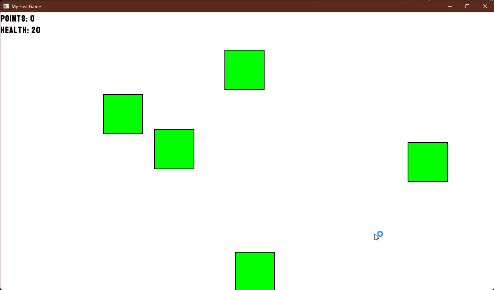
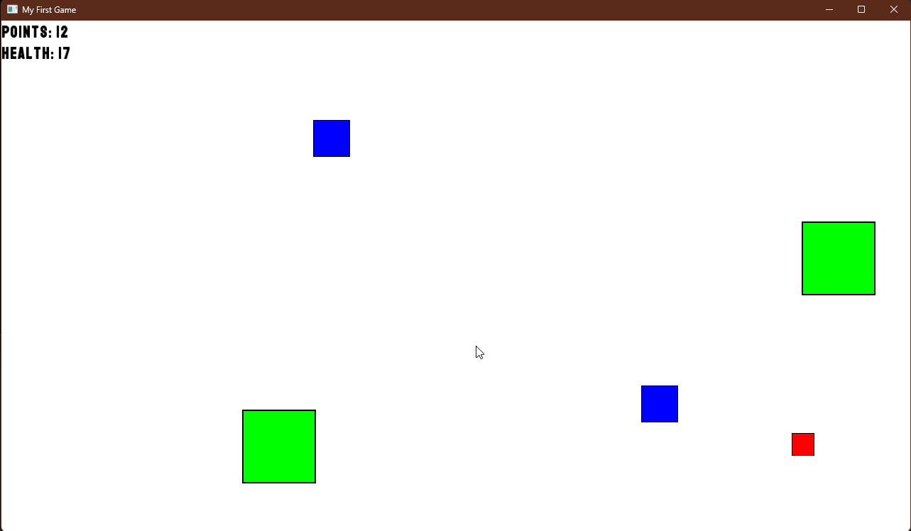

# game_SFML

## Description
This is a simple clicker game where the player's only objective is to get a highscore. Colored blocks will spawn randomly and it's up to the player to stop the block from reaching the end of the window's border. There's only 1 difficulty, and when 20 blocks cross the bottom part of the window, the player loses. 

## Game images

